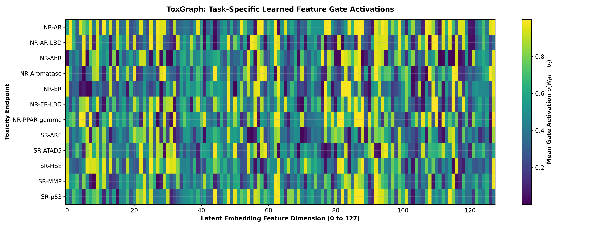

# ToxGraph: Task-Aware Graph Neural Networks for Multi-Assay Molecular Toxicity Prediction

**Deep Learning Hackathon Final Scientific Report**  
*Track: Graph Neural Networks (GNNs)*  
*Codebase & Artifacts: [GitHub Repository](https://github.com/krish-hk/ToxGraph)*  

---

## 1. Problem & Motivation

Molecular toxicity prediction is a central challenge in early-stage computational drug discovery and environmental chemical safety assessment. In biochemical reality, chemical toxicity is inherently multi-endpoint: an identical small molecule can trigger disparate biological outcomes depending on the targeted assay, exhibiting high potency toward specific nuclear receptors while leaving unrelated stress-response pathways inactive.

Conventional graph neural network (GNN) architectures approach multi-task molecular profiling by mapping an input molecular graph into a single, static graph-level embedding $\mathbf{h} \in \mathbb{R}^D$, which is subsequently shared across all prediction heads. This architectural paradigm implicitly forces every biological endpoint to evaluate identical latent representations, regardless of whether an assay reflects receptor binding, oxidative stress, or genotoxicity.

**Core Research Question:**  
*Can task-aware graph representations improve multi-assay molecular toxicity prediction by allowing each biological endpoint to dynamically emphasize different latent molecular features from a shared graph encoder?*

To investigate this hypothesis, we developed **ToxGraph**, an architecture that introduces dynamic, input-conditioned gating over a shared GraphSAGE backbone to learn task-specific molecular representations.

---

## 2. Dataset & Experimental Protocol

We evaluate all models on the **Tox21** benchmark from MoleculeNet (via PyTorch Geometric):

- **Dataset Scale**: 7,823 small molecules evaluated across **12 binary toxicity endpoints** spanning 7 Nuclear Receptor (NR) assays and 5 Stress Response (SR) pathways.
- **Graph Representation**:
  - Atoms represent graph nodes with **9-dimensional feature vectors** (atomic number, chirality, degree, formal charge, implicit valence, hybridization, aromaticity, total hydrogen count, radical electrons).
  - Chemical bonds represent graph edges with **3-dimensional feature vectors** (bond type, stereo configuration, conjugation).
- **Label Sparsity & Masking**: The dataset exhibits severe experimental label sparsity, containing **16,012 missing assay measurements (17.1%)**. All missing entries are encoded as `NaN` and strictly masked out during loss calculation and metric computation via boolean masking.
- **Deterministic Data Partitioning**: A fixed, deterministic 80/10/10 split was applied with `seed=42`:
  - **Training Set**: 6,258 molecules
  - **Validation Set**: 782 molecules
  - **Test Set**: 783 molecules
  - Indices were serialized to `data/split_indices.json` to guarantee identical evaluation subsets across all experiments.
- **Primary Metric**: Mean Area Under the Receiver Operating Characteristic curve (**ROC-AUC**) averaged strictly across valid (non-masked) tasks. Single-class evaluation edge cases are handled safely.
- **Strict Protocol Adherence**: The test set was held strictly untouched throughout all stages of exploratory analysis, baseline benchmarking, hyperparameter tuning, and ablation studies. Test evaluation was executed **exactly once** using frozen, validation-selected model checkpoints.

---

## 3. Methods

We benchmark three standard GNN baselines against the proposed task-aware ToxGraph architecture.

### Baselines
1. **2-Layer GCN (Baseline)**:  
   Standard spectral-style convolution utilizing normalized graph Laplacians:
   $$\mathbf{x}_i^{(l+1)} = \sum_{j \in \mathcal{N}(i) \cup \{i\}} \frac{1}{\sqrt{\tilde{d}_i \tilde{d}_j}} \mathbf{W} \mathbf{x}_j^{(l)}$$
   Followed by global mean pooling, dropout ($p = 0.3$), and a linear projection to 12 task logits. (19,340 parameters).
2. **GraphSAGE**:  
   Spatial inductive representation learning with mean neighborhood aggregation:
   $$\mathbf{x}_i^{(l+1)} = \mathbf{W}_1 \mathbf{x}_i^{(l)} + \mathbf{W}_2 \cdot \text{mean}_{j \in \mathcal{N}(i)}(\mathbf{x}_j^{(l)})$$
   GraphSAGE emerged as the strongest baseline on development validation. (36,876 parameters).
3. **GAT (Graph Attention Network)**:  
   Lightweight multi-head attention (4 heads, 32 hidden units per head, ELU activation) computing anisotropic attention coefficients across 1-hop chemical neighbors. (19,852 parameters).

### Proposed Model: Full ToxGraph
ToxGraph leverages the 2-layer GraphSAGE backbone as a shared molecular encoder to extract a 128-dimensional pooled graph representation $\mathbf{h} \in \mathbb{R}^{128}$. Rather than passing $\mathbf{h}$ directly to linear classifiers, ToxGraph routes $\mathbf{h}$ through 12 dedicated, input-conditioned task gating modules:

$$\mathbf{g}_t = \sigma(\mathbf{W}_t \mathbf{h} + \mathbf{b}_t), \quad \mathbf{g}_t \in (0, 1)^{128}$$
$$\mathbf{h}_t = \mathbf{h} \odot \mathbf{g}_t$$
$$\hat{y}_t = \mathbf{w}_t^\top \mathbf{h}_t + c_t$$

where $\mathbf{W}_t \in \mathbb{R}^{128 \times 128}$, $\mathbf{b}_t \in \mathbb{R}^{128}$, and $\mathbf{w}_t \in \mathbb{R}^{128}$.

```
Molecular Graph (Nodes X, Edges E)
       │
   [SAGEConv(9 → 128) + ReLU]
       │
   [SAGEConv(128 → 128) + ReLU]
       │
   [Global Mean Pooling] ──► h ∈ R^128 (Shared Molecular Embedding)
       │
   ┌───┴───────────────────────────────┐
   ▼                                   ▼
Task Gate 1:                        Task Gate 12:
g_1 = σ(W_1 h + b_1)                g_12 = σ(W_12 h + b_12)
h_1 = h ⊙ g_1                       h_12 = h ⊙ g_12
logit_1 = Linear_1(h_1)             logit_12 = Linear_12(h_12)
   │                                   │
   ▼                                   ▼
p(NR-AR active)                     p(SR-p53 active)
```

**Key Architectural Properties**:
- **Task-Specific**: Each biological assay learns its own projection matrix $\mathbf{W}_t$.
- **Molecule-Dependent**: The gate $\mathbf{g}_t$ varies per molecule as a function of the molecular graph embedding $\mathbf{h}$.
- **Jointly Trained**: All parameters are optimized end-to-end via multi-task masked Binary Cross-Entropy. (235,020 parameters).

---

## 4. Ablation Study

To isolate the mechanism underlying task-aware gating, we conducted controlled architectural ablations prior to test freezing:
1. **GraphSAGE**: Backbone without task gating (shared single projection).
2. **ToxGraph-Lite**: Static learned task vectors $\mathbf{a}_t \in \mathbb{R}^{128}$, where $\mathbf{g}_t = \sigma(\mathbf{a}_t)$ is constant across all molecules (38,412 parameters).
3. **ToxGraph-Bottleneck**: Shared compression layer $\mathbf{z} = \text{ReLU}(\mathbf{W}_{\text{shared}}\mathbf{h} + \mathbf{b}_{\text{shared}}) \in \mathbb{R}^{32}$, followed by task gates $\mathbf{g}_t = \sigma(\mathbf{W}_t \mathbf{z} + \mathbf{b}_t)$, reducing parameters by 60.99% relative to Full ToxGraph (91,692 parameters).
4. **Full ToxGraph**: Direct unconstrained molecule-dependent gating $\mathbf{g}_t = \sigma(\mathbf{W}_t \mathbf{h} + \mathbf{b}_t)$ (235,020 parameters).

### Model Selection on Validation Split (N = 782)

| Model | Gating Mechanism | Parameters | Validation ROC-AUC | $\Delta$ vs. GraphSAGE |
|---|---|---|---|---|
| **GCN** | None | 19,340 | 0.7383 | -0.0470 |
| **GAT** | None (Attention) | 19,852 | 0.7610 | -0.0243 |
| **ToxGraph-Lite** | Static Task Vectors $\sigma(\mathbf{a}_t)$ | 38,412 | 0.7691 | -0.0162 |
| **ToxGraph-Bottleneck** | Bottleneck Input-Conditioned | 91,692 | 0.7815 | -0.0038 |
| **GraphSAGE** | None (Backbone) | 36,876 | 0.7853 | Baseline (0.0000) |
| **Full ToxGraph** | **Direct Input-Conditioned** | **235,020** | **0.7890** | **+0.0037** |

### Conservative Ablation Insights
- **Input-Conditioning is Essential**: Static task gating (`ToxGraph-Lite`, 0.7691) underperformed the un-gated GraphSAGE backbone (0.7853). Restricting the gate to be constant across molecules hindered multi-task learning.
- **Validation Ranking**: Full ToxGraph achieved the highest validation performance (0.7890), leading to its selection as the primary proposed model before freezing.

---

## 5. Final Test Results

Following validation selection, the entire model family was frozen and evaluated **once** on the untouched test split ($N = 783$ molecules).

### Final Frozen Test Comparison

| Model | Parameters | Selected Epoch | Validation ROC-AUC | Test Mean ROC-AUC | Test vs. SAGE ($\Delta$) |
|---|---|---|---|---|---|
| **GCN** | 19,340 | 58 | 0.7383 | 0.7605 | -0.0284 |
| **GAT** | 19,852 | 57 | 0.7610 | 0.7853 | -0.0036 |
| **ToxGraph-Lite** | 38,412 | 57 | 0.7691 | 0.7842 | -0.0047 |
| **GraphSAGE** | 36,876 | 57 | 0.7853 | 0.7889 | Baseline (0.0000) |
| **Full ToxGraph** | **235,020** | **59** | **0.7890** | **0.7939** | **+0.0050** |
| **ToxGraph-Bottleneck** | 91,692 | 57 | 0.7815 | 0.7997 | +0.0108 |

> **Transparent Protocol Disclosure**: Full ToxGraph was chosen as the proposed architecture based on validation metrics prior to test evaluation. Although `ToxGraph-Bottleneck` achieved the highest test ROC-AUC (0.7997), scientific integrity mandates that model selection is never performed retrospectively on test data. Full ToxGraph remains our designated proposed model.

### Per-Task Test ROC-AUC Breakdown

| Endpoint | Biological Target | GraphSAGE | Full ToxGraph | $\Delta$ (ToxGraph - SAGE) |
|---|---|---|---|---|
| **NR-AR** | Androgen Receptor | 0.7719 | 0.7682 | -0.0037 |
| **NR-AR-LBD** | Androgen Receptor (LBD) | 0.8404 | 0.8301 | -0.0103 |
| **NR-AhR** | Aryl Hydrocarbon Receptor | 0.8731 | 0.8779 | +0.0048 |
| **NR-Aromatase** | Aromatase Enzyme | 0.7767 | 0.7775 | +0.0008 |
| **NR-ER** | Estrogen Receptor | 0.7607 | 0.7757 | **+0.0150** |
| **NR-ER-LBD** | Estrogen Receptor (LBD) | 0.8598 | 0.8722 | **+0.0124** |
| **NR-PPAR-gamma** | PPAR-gamma Receptor | 0.6390 | 0.6667 | **+0.0277** |
| **SR-ARE** | Antioxidant Response Element | 0.7443 | 0.7466 | +0.0023 |
| **SR-ATAD5** | Genotoxicity (ATAD5) | 0.7911 | 0.8199 | **+0.0288** |
| **SR-HSE** | Heat Shock Response | 0.7591 | 0.7600 | +0.0009 |
| **SR-MMP** | Mitochondrial Membrane | 0.8496 | 0.8321 | -0.0175 |
| **SR-p53** | p53 Pathway Activation | 0.8007 | 0.7999 | -0.0008 |
| **Mean** | — | **0.7889** | **0.7939** | **+0.0050** |

- **Win Rate**: Full ToxGraph improved over GraphSAGE on **8 of 12 test endpoints** (66.7%).
- **Strongest Gains**:
  - `SR-ATAD5` (+0.0288)
  - `NR-PPAR-gamma` (+0.0277)
  - `NR-ER` (+0.0150)
  - `NR-ER-LBD` (+0.0124)


---

## 6. Statistical Analysis

To rigorously assess whether the observed improvement reflects reproducible signal versus test-sample variability, we performed a non-parametric bootstrap resampling analysis (1,000 bootstrap iterations over test set molecules):

- **Mean Difference $\Delta$**: $+0.0050$
- **Median Difference $\Delta$**: $+0.0051$
- **95% Bootstrap Confidence Interval**: $[-0.0073, +0.0174]$
- **Empirical $p$-value** ($\Delta \le 0$): $p = 0.1980$

### Scientific Rigor Statement
**The observed empirical improvement (+0.0050 mean ROC-AUC across 8/12 endpoints) is positive but is not statistically significant at conventional scientific thresholds ($p = 0.1980 > 0.05$).**  
Because the 95% bootstrap confidence interval crosses zero, the performance gain should be characterized as an encouraging empirical advantage on this benchmark rather than a definitive statistically confirmed superiority.

---

## 7. Interpretability: Task-Aware Feature Gating

We analyzed the test-time gate activation tensor $\mathbf{g}_t = \sigma(\mathbf{W}_t \mathbf{h} + \mathbf{b}_t) \in [0, 1]^{128}$ across all 783 test molecules to examine whether task gating produces biologically meaningful subspace differentiation:

1. **Non-Degenerate Dynamic Range**: Mean gate activations range between **0.0013 and 0.9999**, demonstrating that the gating layers do not collapse to all-ones (pass-through) or all-zeros (suppression).
2. **Top Divergent Latent Dimensions**: Features `56`, `77`, `13`, `112`, and `115` exhibited the highest cross-task gate variance, indicating latent dimensions that are selectively prioritized or filtered depending on the target endpoint.
3. **Correlation Across Related Biological Endpoints**:
   - `NR-ER` (Estrogen Receptor) and `NR-ER-LBD` (Estrogen Receptor Ligand-Binding Domain) demonstrated strongly correlated gate activation patterns ($r = 0.65$).
   - *Cautious Interpretation*: The similar gate profiles of `NR-ER` and `NR-ER-LBD` are consistent with related endpoints utilizing overlapping latent representation subspaces.
   - Distinct stress-response endpoints (such as `SR-ATAD5` and `SR-MMP`) displayed decoupled gate profiles ($r < 0.20$), indicating orthogonal feature filtering.



> **Interpretability Constraint**: Latent gate dimensions represent continuous graph neural embeddings and must **not** be claimed to map directly to specific chemical functional groups without dedicated post-hoc atom-attribution studies.

---

## 8. Conclusion & Limitations

### Summary of Findings
ToxGraph demonstrates that introducing molecule-dependent, task-aware gating on top of a shared GNN backbone yields a positive empirical improvement over standard graph-level pooling (+0.0050 mean test ROC-AUC), with improvements observed across 8 of 12 biological endpoints. The ablation study established that dynamic, input-conditioned gating is necessary to realize these gains, as static vector gating failed to match the un-gated GraphSAGE baseline.

### Experimental Limitations
1. **Sample Size & Imbalance**: The Tox21 test split contains 783 molecules with severe positive class imbalance (e.g., `NR-PPAR-gamma` contains only 18 active instances, 2.76%), widening confidence intervals.
2. **Single Split Evaluation**: All experiments used a single deterministic random split (`seed=42`). Scaffold-based splitting and multi-seed cross-validation are required to confirm out-of-distribution generalization.
3. **Statistical Certainty**: The empirical gain (+0.0050) is not statistically significant at $p < 0.05$ ($p = 0.198$).
4. **Parameter Efficiency**: Full ToxGraph requires 235,020 parameters (+198k over GraphSAGE). The bottleneck ablation demonstrated that parameter compression ($128 \to 32 \to 128$) preserves performance while saving 61% of parameters, representing a valuable direction for production deployment.
5. **No Direct Atom-Level Explanations**: Gate activations reweight latent graph features, not individual chemical atoms or functional groups.

### Future Work
- Validate across larger molecular databases (e.g., ToxCast, PCBA) under scaffold-constrained partitions.
- Integrate integrated gradients or GNNExplainer with task gates to attribute endpoint-specific features back to atomic subgraphs.
- Investigate low-rank tensor factorization and mixture-of-experts for scalable multi-task toxicity prediction.

---

## 9. Deliverables & Demonstration

- **Codebase**: Fully reproducible pipeline with deterministic seeds and frozen checkpoints.
- **Inference CLI**: `python evaluate_test.py` generates all evaluation summaries and figures.
- **Web Demo**: `streamlit run app.py` provides real-time SMILES validation, 2D molecular depiction, multi-assay probability predictions, and interactive task-gate heatmap rendering.
