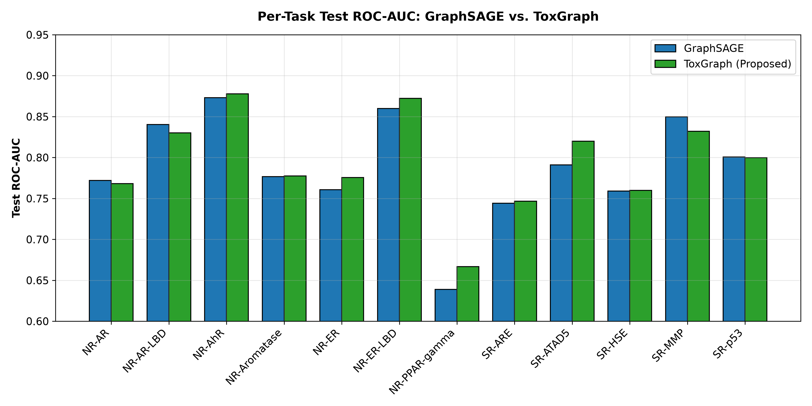

# ToxGraph
## Task-Aware Graph Neural Networks for Multi-Assay Molecular Toxicity Prediction

**Track 3 / Graph Neural Networks | Tox21 / MoleculeNet | Graph-level prediction**

### Abstract
Toxicity screening involves multiple endpoints with incomplete assay coverage. ToxGraph adds molecule-dependent, endpoint-specific gates to a shared two-layer GraphSAGE encoder. We compare the mandatory two-layer GCN baseline, GAT, GraphSAGE, static gates and compressed dynamic gates on 7,823 Tox21 molecules using a fixed seed-42 split and masked multi-task learning. Full ToxGraph was selected on validation ROC-AUC (0.7890) before final test evaluation. Its test mean ROC-AUC is 0.7939 versus GCN 0.7605 and GraphSAGE 0.7889, improving 8/12 endpoints. The GraphSAGE comparison is not statistically significant: paired bootstrap 95% CI [-0.0073, +0.0174], empirical p = 0.198. Bottleneck gating achieved the highest test score (0.7997) but remains an ablation, not a retrospective primary-model selection. Gate analysis illustrates task-dependent latent reweighting without establishing chemical substructure explanations.

### 1. Problem and contribution
A molecular assay response is endpoint-specific. A shared graph embedding with linear task outputs already allows different endpoint weights, but those weights are fixed across molecules. Our question is whether an additional nonlinear, molecule-dependent reweighting helps multi-assay prediction. The contribution is an implemented task-gating design and ablation analysis on Tox21, not a claim that gating or task conditioning is globally unprecedented.

### 2. Data and protocol
Tox21 [1], loaded through PyTorch Geometric [5], contains 7,823 graphs and 12 binary endpoints. Nine atom-feature columns encode atomic number, chirality, degree, formal charge, hydrogen count, radical electrons, hybridization, aromaticity and ring membership. Three bond-attribute columns encode bond type, stereo and conjugation. **All frozen models use atom features and connectivity; bond attributes are not consumed.** Atom category indices are cast to floats without learned categorical embeddings.

There are 16,012 missing labels out of 93,876 entries (17.1%). NaN entries are masked from BCE loss and each endpoint's ROC-AUC. Tasks lacking two observed classes are skipped; all 12 are valid in the frozen test evaluation. The primary metric is macro mean ROC-AUC across valid tasks, reported to four decimals.

The fixed random split is **6,258 train / 782 validation / 783 test**, with **seed = 42** and saved indices in `data/split_indices.json`. All models share the split. Training uses only train batches; checkpoint selection uses validation. The documented historical final evaluation used frozen checkpoints, with Full selected before test disclosure. Whole-dataset label summaries exist in training diagnostics; we therefore distinguish no test training/tuning from a stronger claim that test labels were never inspected. Source and artifacts cannot prove the number of historical evaluation invocations.

<!-- pagebreak -->

### 3. Method and training
GCN [2] has exactly two GCNConv layers (9 → 128 → 128), ReLU, global mean pooling, dropout and 12 linear outputs. GraphSAGE [3] uses two mean-aggregation SAGEConv layers with the same widths and readout. GAT [4] uses four first-layer attention heads of 32 channels, then one 128-channel head, with ELU and attention dropout. All models apply pooled dropout 0.3.

Full ToxGraph shares the two-layer GraphSAGE encoder. For pooled representation h of width 128, each endpoint t has its own gate and linear prediction head:

```text
h = Dropout(MeanPool(GraphSAGEEncoder(graph)))
g_t = sigmoid(W_t h + b_t)
h_t = h * g_t
logit_t = Linear_t(h_t)
```

Here W_t is 128 × 128. Gates depend on both molecule and endpoint; sigmoid(logit_t) gives the predicted assay activity probability. Models are jointly trained with Adam, learning rate 0.001, batch size 64, maximum 60 epochs and patience 15. Checkpoints retain the best four-decimal validation mean ROC-AUC (earlier epoch on a tie). No pretrained weights are loaded. Dropout is disabled for validation, test and demo inference.

### 4. Ablation and frozen results
The ablation ladder is **GraphSAGE (no gate) → Lite (static task vectors) → Bottleneck (compressed dynamic gates) → Full (direct dynamic gates)**. Lite uses g_t = sigmoid(a_t), constant across molecules. Bottleneck first computes z = ReLU(W_shared h + b_shared), width 32, then per-task 32 → 128 sigmoid gates. All share the GraphSAGE backbone; parameter counts differ.

| Model | Parameters | Epoch | Validation | Test |
|---|---:|---:|---:|---:|
| GCN (mandatory 2-layer) | 19,340 | 58 | 0.7383 | 0.7605 |
| GAT | 19,852 | 57 | 0.7610 | 0.7853 |
| GraphSAGE | 36,876 | 57 | 0.7853 | 0.7889 |
| ToxGraph-Lite | 38,412 | 57 | 0.7691 | 0.7842 |
| ToxGraph-Bottleneck | 91,692 | 57 | 0.7815 | **0.7997** |
| Full ToxGraph (primary) | 235,020 | 59 | **0.7890** | **0.7939** |

Table 1. Mean ROC-AUC; epoch is the validation-selected checkpoint, not test-selected. All reported scores remain frozen.

**Full ToxGraph beats mandatory GCN by +0.0334 test ROC-AUC and GraphSAGE by +0.0050.** Full had the highest validation score. Bottleneck unexpectedly generalized best on this single test split (0.7997); it is prominently reported without retrospective model re-selection.

Static gates underperformed GraphSAGE on both splits; both dynamic variants outperformed static gates. Bottleneck was below GraphSAGE on validation, whereas Full exceeded it. These observations support further study, not proof that dynamic gating is necessary. Static gates can be absorbed into linear head weights; their lower score may reflect optimization. A parameter-matched nonlinear head control is missing.

<!-- pagebreak -->

### 5. Endpoint results and uncertainty
Full ToxGraph improved on 8 of 12 test endpoints. The largest gains over GraphSAGE were SR-ATAD5 (+0.0288), NR-PPAR-gamma (+0.0277), NR-ER (+0.0150) and NR-ER-LBD (+0.0124). It declined on NR-AR, NR-AR-LBD, SR-MMP and SR-p53; the largest decline was SR-MMP (-0.0175). Full per-task numbers are retained in `results/final/test_model_comparison.csv`.



Figure 1. Paired endpoint comparison from the frozen evaluation. The vertical axis starts at 0.60; small differences should not be read as large absolute gains.

The paired non-parametric bootstrap resamples 783 molecule rows with replacement, preserving each row's missing-label pattern and pairing both models. It uses 1,000 resamples and seed 42, recalculating valid-task macro ROC-AUC. The original implementation computes bootstrap differences from four-decimal model means; this quantization is preserved.

**Observed mean test delta: +0.0050. Bootstrap mean: +0.0050; median: +0.0051; 95% percentile CI: [-0.0073, +0.0174]; empirical p = 0.198.** The empirical p is the fraction of bootstrap deltas at or below zero, not a calibrated null-hypothesis p-value. The interval crosses zero: the positive empirical trend is **not statistically significant**. These intervals describe test-molecule sampling uncertainty conditional on fitted models, not variation across training seeds or model selection.

### 6. Gate interpretation
The frozen mean gate matrix has activations approximately 0.0013–0.9999 (stored maximum 0.9999746). Dimensions 56, 77, 13, 112 and 115 have the highest cross-task variance. This is variation across endpoint mean profiles; the range alone does not quantify gate variation across molecules or prove biological relevance.

The preserved gate-similarity artifact indicates only weak positive similarity between NR-ER and NR-ER-LBD, approximately r ≈ 0.25 based on the saved figure. This is descriptive latent-space evidence only and is not evidence of direct biological equivalence. These similar gate profiles are consistent with related endpoints using overlapping latent representation subspaces, but provide limited evidence. Exact coefficients are not retained in the summary JSON. Gate magnitudes alone are not feature importance: activations and output weights also affect logits. Latent dimensions are not identified chemical functional groups or toxicophores.

<!-- pagebreak -->

### 7. Limitations and next steps
One random split and seed limit generalization claims. The attachment specifies fixed splits but supplies no Tox21 index file; agreement with any separately provisioned organizer split remains unverified. Random splits may share molecular scaffolds across partitions. NR-PPAR-gamma has only 18 positive test labels among 653 observed labels, increasing uncertainty. Assay activity is not equivalent to real-world toxicity, and probabilities have not been calibrated.

Full has 235,020 parameters, 6.37 times GraphSAGE. Bottleneck saves 60.99% relative to Full. Its stronger test performance is consistent with an efficiency opportunity but does not establish that compression caused better generalization. The models omit bond attributes and use numeric categorical codes. Capacity-matched heads, scaffold evaluation, repeated training seeds, edge-aware encoders and calibrated probabilities are future studies requiring a separately planned evaluation protocol. No such changes or new benchmark results are included here.

### 8. Reproducibility and demonstration
After environment installation, **`python reproduce.py`** runs all six training configurations and final evaluation in a fresh `runs/reproduction/` directory. It records validation selection before test evaluation and preserves shipped checkpoints, results and split indices. This is a post-disclosure reproduction, not a newly untouched test. The wrapper was dry-run checked during the submission audit; no retraining was performed. `python verify_submission.py` checks frozen hashes, checkpoint metadata, split integrity, masked metrics and inference without evaluating test performance.

Use `python -m pip install -r requirements-lock.txt` for the observed audit environment (Windows, Python 3.13.15, CPU PyTorch); it is not an independently verified record of the original training environment. Cross-platform fallback requirements and commands are in README. PyG downloads Tox21 on first use and reuses cached data thereafter. Seeding Python, NumPy and PyTorch and setting cuDNN flags does not guarantee identical GPU reductions across hardware.

**Demo:** `python -m streamlit run app.py`. The frozen Full checkpoint accepts validated SMILES, uses the same PyG featurization as training, renders a molecule, displays all 12 predicted assay activity probabilities and a 12 × 128 gate heatmap. Research use only; no medical or chemical safety determination. A recorded demo is required by the rubric and remains an outstanding submission item.

### References and implementation attribution
[1] Wu et al. MoleculeNet: a benchmark for molecular machine learning. Chemical Science, 2018. https://doi.org/10.1039/C7SC02664A

[2] Kipf and Welling. Semi-Supervised Classification with Graph Convolutional Networks. ICLR, 2017. https://arxiv.org/abs/1609.02907

[3] Hamilton, Ying and Leskovec. Inductive Representation Learning on Large Graphs. NeurIPS, 2017. https://arxiv.org/abs/1706.02216

[4] Velickovic et al. Graph Attention Networks. ICLR, 2018. https://arxiv.org/abs/1710.10903

[5] PyTorch Geometric: MoleculeNet loader, from_smiles graph conversion, GCNConv, SAGEConv and GATConv. https://pytorch-geometric.readthedocs.io/

Implementation dependencies include PyTorch (training), RDKit (SMILES and depiction), scikit-learn (ROC-AUC), NumPy/pandas (analysis), Matplotlib (figures), Streamlit (demo) and ReportLab (PDF). No external pretrained model is used. Repository: https://github.com/krish-hk/ToxGraph
